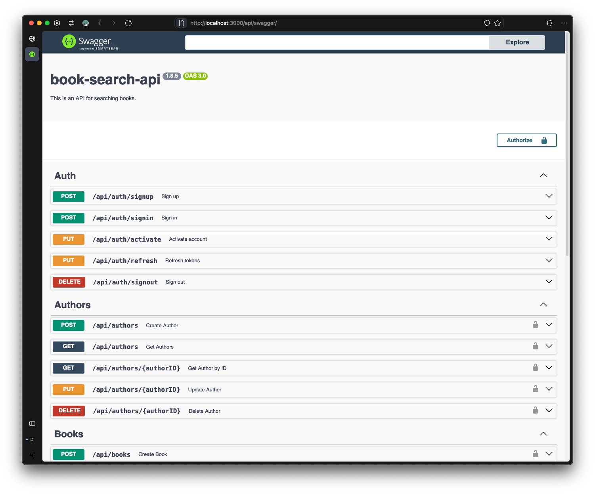
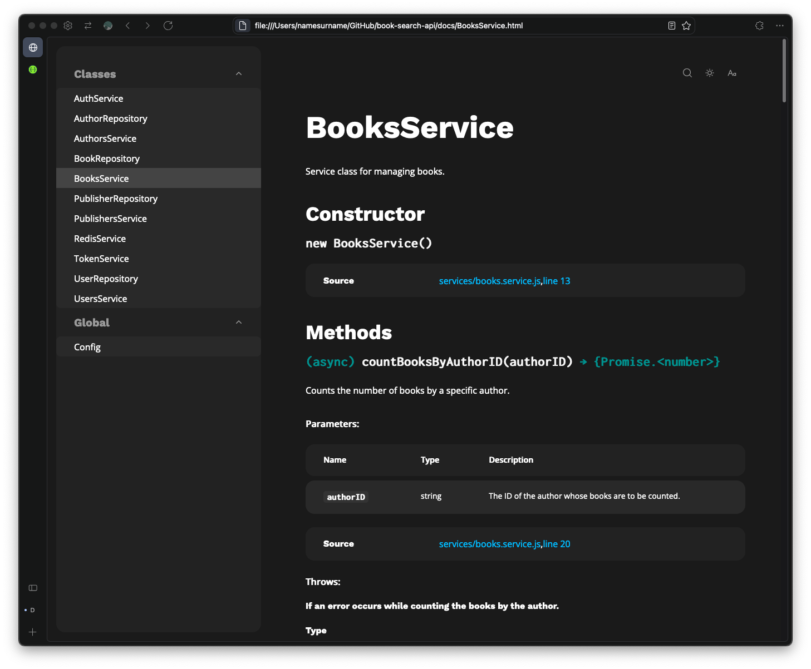

## Book Search API [](https://github.com/otegecmis/book-search-api/blob/main/LICENSE.md)

A backend RESTful API for book search, built with Node.js and Express.js.

- Built the API with `Node.js` and `Express.js`, using the `MVC + Service + Repository` pattern.
- Used `PostgreSQL` and `Prisma` ORM for data storage and management.
- Implemented `Redis` for authentication blacklisting to handle invalid tokens.
- Documented the API with `Swagger` and `JSDoc` for clear developer references.
- Wrote unit and integration tests with `Jest` and `SuperTest`.
- Set up automatic `Semantic Release` using `GitHub Actions` for version management.

### 1. Documentation

Two types of documentation have been prepared: `Swagger` and `JSDoc.` 

#### 1.Swagger

To access `Swagger` documentation, make sure the `NODE_ENV` in the .env file is set to `development`.

Then, you can access it via `http://localhost:PORT/api/swagger`

<div style="float: left;">
    
</div>

#### JSDoc

To access `JSDoc`, run the command `npm run doc` from the root directory of the project. The documentation will be available in the newly created `docs` folder.

<div style="float: left;">
    
</div>

### 2. Installation

1. **Clone the repository**

```sh
git clone https://github.com/otegecmis/book-search-api.git
```

2. **Navigate to the project directory**

```sh
cd book-search-api
```

> *🚧 Necessary information will be added soon.*